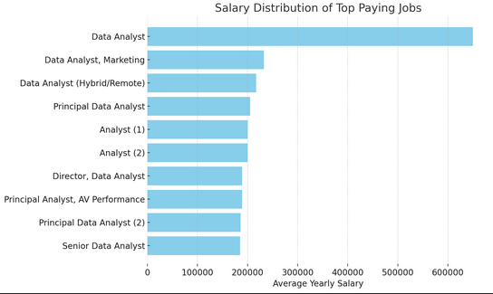

# Introduction
This project focuses on the analyse and the interaction of a data job market database via SQL. Focusing on analyst roles, it explores the top-paying jobs, in-demnd skills, and where high demand meets high salary in analytical roles.

SQL queries to explore this database? Check them out here: [project_1_sql folder](/project_1_sql/)
# Background
This project was influenced by the importance of understanding the data job market and identifying the key skills most in demand. It provided valuable insight into which tools and technologies are essential for data professionals, helping me make more informed decisions about what to learn and where to focus my upskilling efforts. At the same time, it gave me practical, hands-on experience with SQL queries and working directly with a large, real-world dataset of job postings. 

### The questions/queries used to gain insight:
1. What are the top-paying analyst jobs?
2. What skills are required for these top-paying jobs?
3. What skills are most in demand for analysts?
4. Which skills are associated with higher salaries?
5. What are the most optimal skills to learn?
# Tools Used
To deep dive into this job market database, the tools utilized to gain these insights were:
- **SQL**: The main analytical tool for my analyse, allowing me to query the database and discover critical insights
- **PostgreSQL**: The chosen database management system to handle the job postings data
- **Visual Studio Code**: Foundation tool used in all my coding, used for the database management/interaction and executing SQL queries
- **Git & GitHub**: Essential for version control and sharin my SQL scripts and analysis, ensuring collaboration and project management
# Analysis
Each query for this project aimed to uncover insights into the data job market. Each query built on the previous, allowing for further investigations and findings. Here's how I approached each question:

### 1. Top Paying Analyst Jobs
To identify the highest-paying roles, I filtered analyst positions by average yearly salary and location. This query highlights the high paying opporuntities in the field.

```sql
SELECT
    job_id,
    company_dim.name AS company_name,
    job_title,
    job_location,
    job_schedule_type,
    salary_year_avg,
    job_posted_date:: DATE
FROM
    job_postings_fact
LEFT JOIN company_dim ON
    company_dim.company_id = job_postings_fact.company_id
WHERE
    job_title LIKE '%Analyst%' AND
    job_location = 'Anywhere' AND
    salary_year_avg IS NOT NULL
ORDER BY 
    salary_year_avg DESC
LIMIT 10;
```
Here's a breakdown of the top analyst jobs:
- **Wide Salarry Range:** Top 10 paying analyst roles range from $185,000 to $650,000, indicting significant salary potential within the field.
- **Diverse Employers:** There is a diverse range of companies within the top 10 roles, showing a broad interest across different industries
- **Job Title Variety:** The results show a diversity of job titles, from the general 'Data Analyst' to 'Director of Analytics', reflecting varied roles and specializations within the analytical field.

 

### 2. Skills for Top Paying Jobs
To understand what skills are required for the top-paying jobs, I used a CTE and joined the job postings data with the skills data, providing insights into what employers value for these roles.
```sql
WITH top_paying_jobs AS ( 
    SELECT
        job_id,
        company_dim.name AS company_name,
        job_title,
        salary_year_avg
    FROM
        job_postings_fact
    LEFT JOIN company_dim ON
        company_dim.company_id = job_postings_fact.company_id
    WHERE
        job_title LIKE '%Analyst%' AND
        job_location = 'Anywhere' AND
        salary_year_avg IS NOT NULL
    ORDER BY 
        salary_year_avg DESC
    LIMIT 50
)

SELECT 
    top_paying_jobs.*,
    skills_dim.skills
FROM top_paying_jobs
INNER JOIN skills_job_dim ON
    skills_job_dim.job_id = top_paying_jobs.job_id
INNER JOIN skills_dim ON 
    skills_dim.skill_id = skills_job_dim.skill_id
ORDER BY 
    salary_year_avg DESC
```
Insights Discovered:
- **SQL** is leading with a bold count of X.
- **Python** follows closely with a bold count of X.
- **Tableau** is also highly sought after, with a bold count of X.
Other skills like **R**, **Snowflake**, **Pandas**, and **Excel** show varying degrees of demand.


### 3. In-Demand Skills for Analysts
This query helped identify the skills most frequently requested in job postings, directing focus to areas with high demand.

```sql
SELECT 
    skills,
    COUNT(skills_job_dim.job_id) AS demand_count
FROM job_postings_fact
INNER JOIN skills_job_dim ON
    skills_job_dim.job_id = job_postings_fact.job_id
INNER JOIN skills_dim ON 
    skills_dim.skill_id = skills_job_dim.skill_id
WHERE
    job_title_short LIKE '%Analyst%'
GROUP BY
    skills
ORDER BY
    demand_count DESC
LIMIT 5
```
Insights uncovered:
- **SQL** and **Excel** are the most important skills for any analyst position, emphasizing the need for strong foundational skills in data processing and spreadsheet manipulation.
- **Programming** and **Visualization Tools** like **Python**, **Tableau**, and **Power BI** are essential, pointing towards the increasing importance of technical skills in data storytelling and decision support.

| Skills   | Demand Count |
|----------|--------------|
| SQL      | 127752       |
| Excel    | 92482        |
| Python   | 76506        |
| Tableau  | 65893        |
| Power BI | 54733        |

*Table of the demand for the top 5 skills in data analyst job postings*

### 4. Skills Based on Salary
Exploring the average salaries associated with different skills revealed which skills are the highest paying.

```sql
SELECT 
    skills,
    COUNT(skills_job_dim.job_id) AS demand_count,
    ROUND(AVG(salary_year_avg), 0) AS average_salary
FROM job_postings_fact
INNER JOIN skills_job_dim ON
    job_postings_fact.job_id = skills_job_dim.job_id
INNER JOIN skills_dim ON 
    skills_job_dim.skill_id = skills_dim.skill_id
WHERE
    job_title_short LIKE '%Analyst%' AND
    salary_year_avg IS NOT NULL
GROUP BY
    skills
ORDER BY
    average_salary DESC
LIMIT 25
```
Insights Discovered:
- **High Demand for Big Data & ML Skills:** Top salaries by analysts skilled in big data technologies, machine learning tools, and Python libraries, reflecting the industry's high valuation of data processing and predictive modeling capabilities.
- **Software Development & Deployment Proficiency:** Knowledge in development and deployment tools indicates a crossover between data analysis and engineering, with a premium on skills that facilitate automation and efficient data pipeline management.
- **Cloud Computing Expertise:** Familiarity with cloud and data engineering tools underscores the growing importance of cloud-based analytics environments, suggesting that cloud proficiency significantly boosts earning potential in data analytics.

### 5. Most Optimal Skills to Learn
Combining insights from demand and salary data, this query utilized two CTEs aimed to discover skills that are both in high demand and have high salaries, offering a strategic focus for skill development.

```sql
WITH skills_demand AS (
    SELECT 
        skills_dim.skill_id,
        skills_dim.skills,
        COUNT(skills_job_dim.job_id) AS demand_count
    FROM job_postings_fact
    INNER JOIN skills_job_dim ON
        job_postings_fact.job_id = skills_job_dim.job_id
    INNER JOIN skills_dim ON 
        skills_job_dim.skill_id = skills_dim.skill_id
    WHERE
        job_title_short LIKE '%Analyst%' AND
        salary_year_avg IS NOT NULL
    GROUP BY
        skills_dim.skill_id
), average_salary AS (
    SELECT 
        skills_job_dim.skill_id,
        ROUND(AVG(job_postings_fact.salary_year_avg), 0) AS avg_salary
    FROM job_postings_fact
    INNER JOIN skills_job_dim ON
        job_postings_fact.job_id = skills_job_dim.job_id 
    INNER JOIN skills_dim ON 
        skills_job_dim.skill_id = skills_dim.skill_id 
    WHERE
        job_title_short LIKE '%Analyst%' AND
        salary_year_avg IS NOT NULL
    GROUP BY
        skills_job_dim.skill_id
)

SELECT
    skills_demand.skill_id,
    skills_demand.skills,
    demand_count,
    avg_salary
FROM
    skills_demand
INNER JOIN average_salary ON
    skills_demand.skill_id = average_salary.skill_id
ORDER BY
    demand_count DESC, 
    avg_salary DESC
LIMIT 25;
```
Insights Learned:
- **Highly-Demanded Programing Skills:** SQL is found to be the most in-demand skill with a demand count of 4204 jobs, and it has a strong salary average of $99,928. Python is also higly sought after (demand count of 2447) and offers a similarly comparable salary of $105,066. Indicating that proficiency in these languages is highly valued but also widely available.
- **Business Intelligence and Visualization Tools:** Tableau and Power BI, with demand counts of 2367 and 1412 respectively, and average salaries around $101,297 and $95,025, highlight the critical role of data visualization and business intelligence in deriving actionable insights from data.
- **Specialized Analytics Tools:** R (demand count: 1410) and SAS (demand count: 658) offer above-average salaries of $102,557 and $97,595, respectively. While not as widely demanded as SQL or Python, they still provide a valuable reason to pursue learning and upskilling in specialized analytics.

| Skill ID | Skills     | Demand Count | Average Salary ($) |
|----------|------------|--------------|-------------------:|
| 0        | sql        | 4204         |            99,928  |
| 181      | excel      | 2693         |             88,781 |
| 1        | python     | 2447         |            105,066 |
| 182      | tableau    | 2367         |            101,297 |
| 183      | power bi   | 1412         |             95,025 |
| 5        | r          | 1410         |            102,557 |
| 196      | powerpoint | 683          |             89,695 |
| 186      | sas        | 658          |             97,595 |
| 188      | word       | 650          |             85,140 |
| 79       | oracle     | 454          |            102,708 |

*Table of the most optimal skills for data analyst sorted by salary*

# What I Learned
Throughout this project, I have developed my understanding and application of SQL through:
- **Advanced Query Design**: Developed hands-on experience in efficiently joining multiple tables and utilizing CTEs and subqueries to streamline complex database interactions.
- **Data Aggregation:** Gained proficiency in leveraging SQL aggregation techniques, such as GROUP BY, and utilizing functions like COUNT() and AVG() to derive meaningful insights from large datasets.
- **Deriving Insights:** Applied analytical thinking to translate complex business questions into actionable SQL queries, driving data-driven decision-making with precision and clarity.

# Conclusions
From the analysis, several key insights emerged:

1. **Top-Paying Data Analyst Jobs**: The highest-paying jobs for analysts offer a wide range of salaries, the highest being $650,000
2. **Skills for Top-Paying Jobs**: High-paying analyst jobs require advanced proficiency in SQL, suggesting it’s a critical skill for earning a top salary.
3. **Most In-Demand Skills**: SQL is also the most demanded skill in the analyst job market, thus making it essential for job seekers (and myself).
4. **Skills with Higher Salaries**: Specialized skills are associated with the highest average salaries, indicating a premium on niche expertise.
5. **Optimal Skills for Job Market Value**: SQL leads in demand and offers for a high average salary, positioning it as one of the most optimal skills for data analysts to learn to maximize their market value.

Overall, This project enhanced my SQL skills and provided valuable insights into the analytical job market. The findings from the analysis serve as a guide to prioritizing skill development. This exploration highlights the importance of continuous learning and adaptation to emerging trends in the field of analytics.
